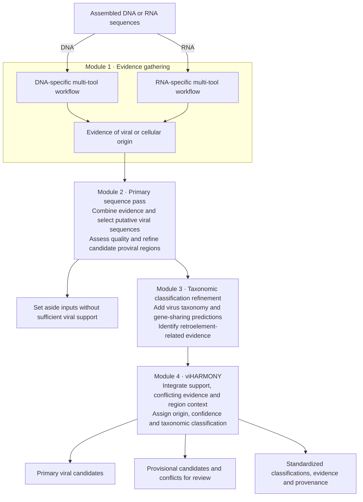

# viSUM

**Viral discovery and standardized classification for assembled DNA and RNA sequences.**

viSUM combines complementary programs to identify candidate viruses—including divergent and understudied viruses—and turn their results into consistent, sequence-level evidence. Its two goals are broader viral detection and interpretable classifications that support cross-study comparisons and reference-database curation.

**Research beta in preparation.** Analysis and preliminary benchmarks have completed in the development environment; clean-install verification remains pending. A tagged beta release has not yet been published.

## How it works



1. **Evidence gathering.** Multiple tools assess viral and cellular origin. DNA and RNA follow distinct workflows, with shared tools and input-specific specialists.
2. **Primary sequence pass.** Evidence from the enabled programs identifies putative viral sequences for quality assessment and candidate proviral-region refinement. Inputs lacking sufficient viral support are set aside; lack of support is not proof of nonviral origin.
3. **Taxonomic classification refinement.** VITAP and vConTACT3 add virus-classification and gene-sharing evidence. TEsorter adds retroelement context to help distinguish retroelement-associated predictions from retrovirus interpretations. **VITAP and vConTACT3 are enabled by default.**
4. **viHARMONY.** The final integration combines the strength and agreement of origin evidence, conflicting cellular/mobile-element signals, and support for retained regions. It reports primary or provisional candidates, evidence-based confidence, candidate proviral status, and taxonomic assignments. Better-supported taxonomy is separated from exploratory assignments, including candidate novel groups. Confidence tiers describe evidence support—not calibrated probabilities.

## Programs and roles

| Program | DNA | RNA | Role | Default |
| --- | --- | --- | --- | --- |
| geNomad | Yes | Yes | Viral/cellular-origin and taxonomic evidence | On |
| VirSorter2 | Yes | Yes | Viral discovery evidence | On |
| Cenote-Taker3 | Yes | Yes | Viral hallmarks and candidate proviral regions | On |
| DeepMicroClass2 | Yes | No | Sequence-origin classification | On for DNA |
| GiantHunter | Yes | No | Giant DNA virus discovery | On for DNA |
| Deep6 | No | Yes | Sequence-origin classification | On for RNA |
| VirBot | No | Yes | RNA virus discovery | On for RNA |
| viCAT | Yes | Yes | Competitive viral/nonviral protein homology and taxonomy | Opt-in; requires both databases |
| CheckV | Yes | Yes | Quality assessment and candidate-region evidence | On |
| TEsorter | Yes | Yes | Retroelement detection and interpretation | On |
| VITAP | Yes | Yes | Additional viral taxonomic classification | **On** |
| vConTACT3 | Yes | Yes | Gene-sharing groups and taxonomic refinement | **On** |

DNA/RNA columns describe viSUM's routing; individual programs differ in biological scope.

## Preliminary performance

The development benchmarks include **539 DNA viral inputs, 874 RNA viral inputs, 2,390 nominal-negative DNA inputs** (cellular, mitochondrial, plasmid, plastid and retroelement sequences), **1,600 clean-RNA negative proxies**, and a separate 200-sequence RNA mobile-element challenge.

These results use the all-tools configuration with viCAT enabled and the optional RNA homology floor on. They are not a measurement of the unmodified quickstart configuration.

| Benchmark endpoint | viSUM | geNomad |
| --- | --- | --- |
| DNA viral sensitivity | **477/539 (88.50%)** | 452/539 (83.86%) |
| RNA viral sensitivity | **788/874 (90.16%)** | 646/874 (73.91%) |
| DNA nominal-negative retention | 101/2,390 (4.23%) | 38/2,390 (1.59%) |
| Clean-RNA nominal-negative retention | 27/1,600 (1.69%) | 18/1,600 (1.13%) |

viSUM retained **25 more DNA positives and 142 more RNA positives net** than geNomad, alongside more nominal-negative inputs. The [full benchmark comparison](docs/benchmarks/preliminary-2026-09.md) includes every discovery method and subgroup results.

**Why “nominal-negative retention”?** A cellular or plasmid source label does not rule out viral genes or an embedded viral region. Review of retained negatives found viral homologs and virus-like gene content; seven plasmid inputs contained coherent capsid/portal/terminase modules supporting phage-like candidates. Phage–plasmids are an established biological category ([Pfeifer et al., 2021](https://doi.org/10.1093/nar/gkab064)). Other retained sequences had mixed or unresolved evidence.

The percentages above therefore measure disagreement with the original benchmark labels—an **apparent, label-based FPR**, not a confirmed biological false-positive rate. Labels remain unchanged for every tool. See the [retained-negative evidence review](docs/benchmarks/retained-negative-context.md).

These are preliminary development tests, not independent external validation. They measure detection, not taxonomic accuracy, calibrated confidence or exact proviral boundaries.

## Get started

See the [usage guide](docs/usage.md) for installation, database preparation, resource settings and batch inputs. Once installed and configured:

```bash
bash ./visum -c visum.config -profile local_safe \
  --input /absolute/path/to/contigs.fasta \
  --prefix sample01 --type dna \
  --outdir results/sample01
```

Use `--type rna` for RNA assemblies. Final candidates, classifications and review outputs are written under `<outdir>/<prefix>_results/viharmony/`.

- [Usage and output guide](docs/usage.md)
- [Database setup](docs/database-setup.md)
- [All documentation](docs/README.md)

For reproducibility, record the viSUM commit/tag and the tool/database versions used. Cite the underlying programs and databases alongside viSUM. Report issues with a redacted command and relevant logs; do not upload confidential sequence data. Research use only.
