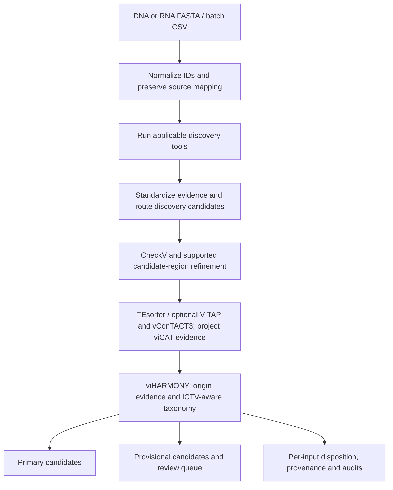

# viSUM

A Nextflow workflow for combining viral-discovery evidence from DNA and RNA sequences, refining candidate regions, and reporting auditable viral-origin and taxonomic decisions.

viSUM has two linked goals: recover more candidate viruses, including understudied viruses, and produce standardized, traceable classifications suitable for cross-study comparison and reference-database curation. Its confidence tiers describe evidence support; they are not calibrated probabilities of correctness. Candidate novel gene-sharing groups are useful discovery outputs, not automatically validated new taxonomic groups.

**Status: development / preliminary research software.** The first public release is being prepared. The performance below is from development benchmarks, not independent clinical or publication-level validation. The integrated workflow is not simply the union of all tool calls, and a predicted proviral region is not a confirmed provirus.

## What the pipeline does



Discovery admits candidates for evaluation; it does not establish their final identity. viHARMONY integrates support, conflicting evidence, region context and taxonomy. It separates strict from exploratory taxonomy and preserves unresolved/conflicting cases for review. A failed or absent taxonomic assignment is not automatically a nonviral decision.

| Component | DNA | RNA | Role | Enabled by default |
| --- | --- | --- | --- | --- |
| geNomad | Yes | Yes | Discovery evidence | Yes |
| VirSorter2 | Yes | Yes | Discovery evidence | Yes |
| Cenote-Taker3 | Yes | Yes | Discovery and region evidence | Yes |
| DeepMicroClass2 | Yes | No | Sequence-classification evidence | Yes, applicable inputs only |
| GiantHunter | Yes | No | Giant DNA virus discovery | Yes, applicable inputs only |
| Deep6 | No | Yes | Sequence-classification evidence | Yes, applicable inputs only |
| VirBot | No | Yes | RNA virus discovery | Yes, applicable inputs only |
| viCAT | Yes | Yes | Competitive viral/nonviral protein homology and taxonomy | **No** |
| CheckV | Yes | Yes | Post-discovery quality and region evidence | Yes |
| TEsorter | Yes | Yes | Transposable-element interpretation | Yes |
| VITAP | Yes | Yes | Post-discovery taxonomic evidence | **No** |
| vConTACT3 | Yes | Yes | Post-discovery gene-sharing/taxonomic evidence | **No** |

These are workflow routing choices, not a claim that each component has equal biological applicability or sensitivity. Nextflow can display defined processes with `[-]` even when no applicable input is routed to them; that is not evidence that a task ran. Use the trace and task counts to distinguish skipped, cached and executed work.

## Prerequisites and setup

The development runs used Linux and Nextflow 26.04.6. Install a compatible Java runtime and Nextflow following the [official Nextflow instructions](https://www.nextflow.io/), and make Conda/Mamba available on `PATH`. The workflow creates its per-tool environments. A clean-clone Linux installation test is still a gate for the first release; native Windows execution is not validated.

```bash
git clone https://github.com/ViDaB-Lab/viSUM.git
cd viSUM

# If nextflow is not on PATH, set this to your actual executable:
export NEXTFLOW_BIN=/absolute/path/to/nextflow

bash ./visum -c visum.config --help
```

The launcher checks `NEXTFLOW_BIN`, then `PATH`, then an executable `../nextflow`. Pass `-c visum.config` explicitly. Do not substitute a CSV/TSV manifest where a single FASTA is required.

### Start with the default configuration

Supply assembled nucleotide sequences; viSUM is not a raw-read assembler.

```bash
bash ./visum -c visum.config -profile local_safe \
  --input /absolute/path/to/contigs.fasta \
  --prefix sample01 --type dna \
  --outdir results/sample01 \
  --max_cpus 8 --max_memory '48 GB'
```

Use `--type rna` for RNA input. The RNA benchmark includes transcript/CDS proxies, so its reported FPR should not be extrapolated to every metatranscriptomic sample. Use `-resume` with the same work cache for interrupted runs; retain the cache and Nextflow run metadata. The quickstart runs the configured defaults and **does not reproduce the all-tools benchmark** below.

The Linux launcher caps aggregate CPU scheduling and, where available, CPU affinity. `--max_memory` is a **per-task request ceiling**, not a guarantee that the sum of concurrent tasks fits that amount of RAM. Choose resources for your system; lowering a limit does not make a large database fit in memory. The approximately 400 GB ceiling used on the development server is not a generic minimum requirement.

### Batch input

Create a **comma-separated** file with exactly these columns; FASTA paths below are relative to `--indir`:

```csv
prefix,type,fasta
dna_sample,dna,dna_contigs.fasta
rna_sample,rna,rna_contigs.fasta
```

```bash
bash ./visum -c visum.config -profile local_safe \
  --prefix_many samples.csv --indir /absolute/path/to/inputs \
  --outdir results/batch01 --max_cpus 8 --max_memory '48 GB'
```

Use a unique prefix for each sample and a new output directory for an independent comparison. Duplicate-prefix rejection is a known pre-release validation gap; do not reuse prefixes in one manifest.

### Databases and optional components

Managed databases and model bundles are stored under `databases/` and `tools/`; Conda environments under `.conda/`. Automatic downloads require network access, disk space and compliance with each upstream resource's terms. Pin and record the actual versions/checksums used; a successful cached run does not test download/install behavior.

viCAT is optional because the tested large viral and nonviral reference assets need separate provisioning and redistribution review. It compares predicted ORF loci against viral and class-aware nonviral references, then summarizes competitive locus/cluster evidence. An RNA protein match does not by itself establish viral genomic origin.

To add viCAT to an otherwise valid command, provide both validated runtime database locations:

```text
--run_vicat true
--vicat_db /absolute/path/to/validated/vicat/database
--vicat_nonviral_db /absolute/path/to/nonviral_classaware_v1
```

Use `bash ./visum -c visum.config --setup` to prepare enabled tools without FASTA inputs or analyses. Selection uses the existing `--run_*` flags. See [database setup](docs/database-setup.md) for shared paths, reuse, limitations and the Linux routing test.

Alternatively, viCAT preparation can build both databases from supplied local sources: the two MetaVR files for the viral side, and classified references or an NCBI manifest/protein/feature-table collection for the nonviral side. See [viCAT database preparation](docs/vicat-database-preparation.md) for exact inputs, recovery behavior and resource requirements. The viral build requests 350 GB RAM by default; this is not a lightweight quickstart. Full-size clean-install verification remains pending. VITAP and vConTACT3 can be enabled with `--run_vitap true` and `--run_vcontact3 true` and their corresponding database parameters. Public prebuilt hosting remains a separate provenance/redistribution decision; no hosted bundle is currently configured.

### Optional RNA homology floor

`--rna_pair_homology_floor true` enables an experimental conservative rule for RNA supported only by the qualified Deep6 + viCAT pair, without strong support. It requires a viral-supported locus with protein length ≥100 aa, bit score ≥100, and query/subject coverage ≥50%. Failing candidates move to provisional output rather than being declared nonviral.

Default is **false**. It has no effect on DNA and is relevant only when Deep6 and viCAT are enabled. The all-tools preliminary results below use **true**. See the [paired ON/OFF analysis](docs/benchmarks/preliminary-2026-09.md#optional-rna-floor-verified-effect) before choosing a setting.

## Reading the outputs

Per-sample outputs are under `<outdir>/<prefix>_results/`. Raw/standardized tool outputs remain in their tool subdirectories; final integration outputs are in `viharmony/`.

| Output suffix | Interpretation |
| --- | --- |
| `.database_candidates.tsv` / `.database_candidates.fasta` | Primary retained candidates; these define the benchmark's viSUM positives |
| `.final.normalized.fasta` / `.final.original_ids.fasta` | Primary sequences with normalized or source-oriented identifiers |
| `.final_metadata.tsv` | Integrated record-level evidence, origin, taxonomy and region information; do not assume every row is a primary retention |
| `.provisional_metadata.tsv` / `.provisional.*.fasta` | Lower-support candidates excluded from primary benchmark counts |
| `.review_queue.tsv` | Decisions/conflicts requiring inspection |
| `.sequence_disposition.tsv` / `.sequence_map.tsv` | Reconcile original inputs, normalized identifiers and derived records |
| `.harmonizer_manifest.json` | Policy settings and output provenance/checksums |

`--harmonizer_audit full` additionally writes compressed row-level audits. Run reports and trace are under `<outdir>/reports/`.

Count original inputs once when comparing detection rates: several region records can derive from one input. `provirus`/`viral_region` annotations are computational candidates, not verified integration events. Provisional/review calls must not be silently counted as high-confidence primary calls. An absence of evidence is not proof of nonviral origin.

## Preliminary performance

Development evidence reviewed 9 September 2026. The all-tools configuration enabled viCAT, VITAP and vConTACT3 as well as the default applicable components, with the RNA floor ON. These are exact **input-level** counts; they do not measure taxonomic accuracy or region-boundary correctness.

| Endpoint | viSUM | geNomad |
| --- | --- | --- |
| DNA positive sensitivity | 477/539 (88.50%) | 452/539 (83.86%) |
| RNA positive sensitivity | 788/874 (90.16%) | 646/874 (73.91%) |
| DNA labelled-negative retention, pooled | 101/2,390 (4.23%) | 38/2,390 (1.59%) |
| Clean-RNA labelled-negative retention | 27/1,600 (1.69%) | 18/1,600 (1.13%) |

viSUM increases sensitivity here at the cost of more labelled-negative retentions. VirBot is also a strong RNA comparator: 749/874 positives and 1/1,600 clean negatives. viCAT alone is more sensitive but retains substantially more controls. No single method wins every endpoint.

Of viSUM's 101 retained DNA-negative parents, 59 have extracted-region evidence, but only 23 of those have a CT3 virion-hallmark annotation in their parent-level summaries. None is independently confirmed as a true provirus by this review. **The headline FPR does not subtract these candidates.**

Read the [complete comparison of all eight discovery tools, negative evidence audit, subgroup results and release gates](docs/benchmarks/preliminary-2026-09.md). Its tables include both native VirSorter2 outputs and the narrower evidence accepted by the current adapter. Benchmark limitations include shared references/development tuning, transcript/CDS proxy negatives, unresolved biological labels, specialist-tool scope and correlated viral segments. These results are preliminary, not a claim of universal superiority or an unbiased estimate on future data.

## Known pre-release issues and contributing

- The finalized VirSorter2 adapter preserves unscored `lt2gene` hallmark predictions as **review-only evidence**, with no invented score or coordinates. They remain available in standardized/native outputs but supply neither discovery-routing nor primary-retention votes. They cannot corroborate an unlocalized extracted child region or bypass the optional Deep6–viCAT RNA homology floor. See the [implementation/replay follow-up](docs/benchmarks/virsorter2-hallmark-followup.md), which also preserves the rejected promotion-policy experiment.
- Full-profile database provisioning, a clean-install smoke test, duplicate-prefix validation, CI and distribution/licensing checks remain release gates.
- Research use only; not validated for clinical diagnosis or public-health decision making.

Report issues with the viSUM commit/tag, command with private paths redacted, input type, tool/database versions, relevant trace/task logs, expected behavior and observed behavior. Do not upload confidential sequence data or credentials. Small non-sensitive reproducible examples are preferred.

## Citation and licensing

No manuscript citation or release DOI is claimed here. Until a release is finalized, identify the repository and exact commit used. Before a public pre-release, maintainers must select an appropriate license, add author/citation metadata, and verify third-party code/database redistribution terms. The absence of a license is **not** permission to reuse or redistribute; see [GitHub's licensing guidance](https://docs.github.com/en/repositories/managing-your-repositorys-settings-and-features/customizing-your-repository/licensing-a-repository).

When reporting analyses, acknowledge the discovery, refinement and taxonomy tools and reference databases actually enabled—not only viSUM. The [release checklist](docs/benchmarks/preliminary-2026-09.md#required-changes-and-release-gates) distinguishes a citable preliminary software release from manuscript-ready validation.
