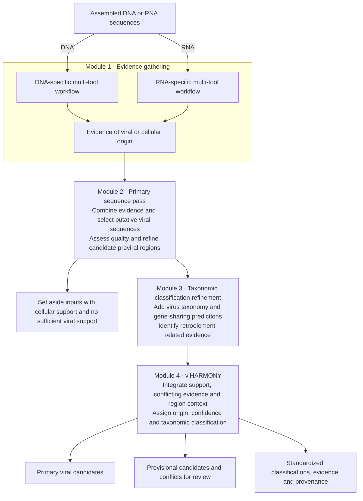

# viSUM

**Motivations**

viSUM was developed to help my students, regardless of experience level, perform in-depth, comprehensive viral analyses of their high-throughput sequencing data. My goal was to make these analyses accessible for their thesis projects without requiring each student to build and integrate a complex computational workflow from scratch. I hope it proves useful to other students, educators, and researchers as well!

**Viral discovery and standardized classification for assembled DNA and RNA sequences.**
 
viSUM combines complementary programs to identify candidate viruses—including divergent and understudied viruses—and turn their results into consistent, sequence-level evidence. Its two goals are broader viral detection and interpretable classifications that support cross-study comparisons and reference-database curation.

**Evidence integration is the core of viSUM** 

viSUM brings together and summarizes origin predictions, protein homology, candidate proviral regions, retroelement context and taxonomic evidence per input sequence. viHARMONY harmonizes results across programs to produce standardized, rank-aware taxonomic assignments with supporting evidence, confidence categories and explicit conflicts, separating supported classifications from exploratory hypotheses. For non-model systems, this helps researchers interpret novel candidates even when a close reference or a confident species-level assignment is unavailable.

**STATUS** 

viSUM is still in active development and benchmarking. At the time of this release, we have performed preliminary benchmarksof the current version (read more below), but we still need to test a complete fresh-install, and we are in the process of a secondary benchmark using the same test dataset used to access the performance of geNomad. 

Overall, this is a beta release, the main archecture should remain stable for the alpha release, however, we are fine tuning some decision making to balance sensitivity and false-positivity. So, please report any issues you come across!

**List of stuff to add**

1. Functional annotation module.
2. Add optional LucaVirus in discovery module (https://github.com/LucaOne/LucaVirus).

The hope is viSUM becomes field-driven, if you have any suggestions for additions that would be useful, please let us know.

## How it works



1. **Evidence gathering.** Multiple tools assess viral and cellular origin. DNA and RNA follow distinct workflows, with shared tools and input-specific specialists.
2. **Primary sequence pass.** Evidence from the enabled programs identifies putative viral sequences for quality assessment and candidate proviral-region refinement. Inputs lacking sufficient viral support are set aside; lack of support is not proof of nonviral origin.
3. **Taxonomic classification refinement.** VITAP and vConTACT3 add virus-classification and gene-sharing evidence. TEsorter adds retroelement context to help distinguish retroelement-associated predictions from retrovirus interpretations.
4. **viHARMONY.** The final integration combines the strength and agreement of origin evidence, conflicting cellular/mobile-element signals, and support for retained regions. It reports primary or provisional candidates, evidence-based confidence, candidate proviral status, and taxonomic assignments. Better-supported taxonomy is separated from exploratory assignments, including candidate novel groups. Confidence tiers describe evidence support—not calibrated probabilities.

## Programs and roles

| Program | DNA | RNA | Role | Default |
| --- | --- | --- | --- | --- |
| geNomad | Yes | Yes | Viral/plasmid-origin, candidate proviral regions, and taxonomic evidence | On |
| VirSorter2 | Yes | Yes | Viral discovery evidence | On |
| Cenote-Taker3 | Yes | Yes | Viral hallmarks, candidate proviral regions, and and taxonomic evidence| On |
| DeepMicroClass2 | Yes | No | Sequence-origin classification (cellular, organelle, or viral) | On for DNA |
| GiantHunter | Yes | No | Giant DNA virus discovery | On for DNA |
| Deep6 | No | Yes | Sequence-origin classification (cellular or viral) | On for RNA |
| VirBot | No | Yes | RNA virus-focused discovery program | On for RNA |
| viCAT | Yes | Yes | Competitive viral/nonviral protein homology and taxonomy | Opt-in; requires both databases. Adds time but increases sensitivity and provides cellular/organelle evidence. |
| CheckV | Yes | Yes | Quality assessment and candidate-region evidence | On |
| TEsorter | Yes | Yes | Retroelement detection and interpretation | On |
| VITAP | Yes | Yes | Additional viral taxonomic classification | On |
| vConTACT3 | Yes | Yes | Gene-sharing groups and taxonomic refinement | On |

DNA/RNA columns describe viSUM's routing; individual programs differ in biological scope.

## Preliminary performance

The preliminary benchmark dataset include **539 DNA viral inputs, 874 RNA viral inputs, 2,390 nominal-negative DNA inputs** (cellular, mitochondrial, plasmid, plastid and retroelement sequences), **1,600 clean-RNA negative proxies**, and a separate 200-sequence RNA mobile-element challenge.

These results use the all-tools configuration with viCAT enabled.

| Benchmark endpoint | viSUM |
| --- | --- |
| DNA viral sensitivity | **477/539 (88.50%)** |
| RNA viral sensitivity | **788/874 (90.16%)** |
| DNA nominal-negative retention (label-based FPR; **see below**) | 101/2,390 (4.23%) |
| Clean-RNA nominal-negative retention (label-based FPR) | 27/1,600 (1.69%) |

**Why “nominal-negative retention”?** The preliminary benchmark used NCBI-derived sequences representing eukaryotic and prokaryotic cellular sources, organellar sequences (mitochondrial and plastid), and plasmids. Unlike the geNomad classification benchmark (the secondary benchmark in progress), which screened chromosome and plasmid data to remove predicted viral content, our nominal-negative sequences were not prefiltered to exclude virus-like regions. Source annotations were used as formal benchmark labels rather than independently verified biological ground truth: a cellular or plasmid source does not exclude viral homologs, integrated viral elements, or embedded proviral regions. Retained formal-negative sequences were therefore counted as false positives under the original labels, with evidence of virus-like content reviewed and reported separately. 

Review of retained negatives found viral homologs and virus-like gene content; seven plasmid inputs contained coherent capsid/portal/terminase modules supporting phage-like candidates. Phage–plasmids are an established biological category ([Pfeifer et al., 2021](https://doi.org/10.1093/nar/gkab064)). Other retained sequences had mixed or unresolved evidence.

**Evidence-adjusted DNA FPR: 1.97% for the virus-like-content discovery endpoint.** 

Review identified **48 retained DNA inputs with localized virion/RdRP hallmarks or CheckV regional evidence plus local viral-protein homology**, and **seven endogenous-retroviral controls also identified by TEsorter**. 

These preliminary development tests quantify detection and negative retention. viSUM also delivers integrated evidence, taxonomic context and confidence reporting; independent evaluation of taxonomic accuracy, confidence calibration and exact proviral boundaries remains future work.

## Get started

See the [usage guide](docs/usage.md) for installation, database preparation, resource settings and batch inputs. Once installed and configured:

```bash
bash ./visum -c visum.config -profile local_safe \
  --input /absolute/path/to/contigs.fasta \
  --prefix sample01 --type dna \
  --outdir results/sample01
```

Use `--type rna` for RNA assemblies. Final candidates, classifications and review outputs are written under `<outdir>/<prefix>_results/viharmony/`.

- [Usage and output guide](docs/usage.md)
- [Database setup](docs/database-setup.md)
- [All documentation](docs/README.md)

## Who to cite

When publishing results from viSUM, cite **viSUM and the underlying programs that contributed to your analysis**, including database preparation. Record the software versions and database releases used; not every optional program runs in every analysis.

**viSUM beta-release citation:** viCAT and viHARMONY are components of viSUM and will be covered by that citation. Manuscript is in prep and will be released as a preprint ASAP.

<!-- Add the viSUM beta-release citation here when available. -->

| Program | Reference |
| --- | --- |
| geNomad | Camargo AP et al. (2024). [Identification of mobile genetic elements with geNomad](https://doi.org/10.1038/s41587-023-01953-y). *Nature Biotechnology* **42**, 1303–1312. |
| VirSorter2 | Guo J et al. (2021). [VirSorter2: a multi-classifier, expert-guided approach to detect diverse DNA and RNA viruses](https://doi.org/10.1186/s40168-020-00990-y). *Microbiome* **9**, 37. |
| Cenote-Taker3 | Tisza MJ et al. (2026). [Cenote-Taker 3 for Fast and Accurate Virus Discovery and Annotation of the Virome](https://doi.org/10.24072/pcjournal.706). *Peer Community Journal*. |
| DeepMicroClass2 | Hou S et al. (2024). [DeepMicroClass sorts metagenomic contigs into prokaryotes, eukaryotes and viruses](https://doi.org/10.1093/nargab/lqae044). *NAR Genomics and Bioinformatics* **6**, lqae044. Cite this original-framework paper as requested by the [DeepMicroClass2 authors](https://github.com/aiguo-11/DeepMicroClass2#citation). |
| GiantHunter | Qu F et al. (2025). [GiantHunter: accurate detection of giant virus in metagenomic data using reinforcement-learning and Monte Carlo tree search](https://doi.org/10.1093/bioinformatics/btaf239). *Bioinformatics* **41** (Suppl. 1), i30–i39. |
| Deep6 | Finke JF, Kellogg CTE and Suttle CA (2023). [Deep6: Classification of Metatranscriptomic Sequences into Cellular Empires and Viral Realms Using Deep Learning Models](https://doi.org/10.1128/mra.01079-22). *Microbiology Resource Announcements* **12**, e01079-22. |
| VirBot | Chen G et al. (2023). [VirBot: an RNA viral contig detector for metagenomic data](https://doi.org/10.1093/bioinformatics/btad093). *Bioinformatics* **39**, btad093. |
| CheckV | Nayfach S et al. (2021). [CheckV assesses the quality and completeness of metagenome-assembled viral genomes](https://doi.org/10.1038/s41587-020-00774-7). *Nature Biotechnology* **39**, 578–585. |
| TEsorter | Zhang RG et al. (2022). [TEsorter: an accurate and fast method to classify LTR-retrotransposons in plant genomes](https://doi.org/10.1093/hr/uhac017). *Horticulture Research* **9**, uhac017. |
| VITAP | Zheng K et al. (2025). [VITAP: a high precision tool for DNA and RNA viral classification based on meta-omic data](https://doi.org/10.1038/s41467-025-57500-7). *Nature Communications* **16**, 2226. |
| vConTACT3 | Bolduc B et al. (2025). [Machine learning enables scalable and systematic hierarchical virus taxonomy](https://doi.org/10.1038/s41587-025-02946-9). *Nature Biotechnology*. |
| Nextflow | Di Tommaso P et al. (2017). [Nextflow enables reproducible computational workflows](https://doi.org/10.1038/nbt.3820). *Nature Biotechnology* **35**, 316–319. |

<details>
<summary>Supporting software and database citations</summary>

Include the following methods where used by the enabled tools or database builders, and follow each tool's citation instructions for additional dependencies:

- **DIAMOND:** Buchfink B, Reuter K and Drost HG (2021). [Sensitive protein alignments at tree-of-life scale using DIAMOND](https://doi.org/10.1038/s41592-021-01101-x). *Nature Methods* **18**, 366–368.
- **MMseqs2:** Steinegger M and Söding J (2017). [MMseqs2 enables sensitive protein sequence searching for the analysis of massive data sets](https://doi.org/10.1038/nbt.3988). *Nature Biotechnology* **35**, 1026–1028. For database building with **Linclust**, also cite their (2018) paper, [Clustering huge protein sequence sets in linear time](https://doi.org/10.1038/s41467-018-04964-5), *Nature Communications* **9**, 2542.
- **Prodigal:** Hyatt D et al. (2010). [Prodigal: prokaryotic gene recognition and translation initiation site identification](https://doi.org/10.1186/1471-2105-11-119). *BMC Bioinformatics* **11**, 119.
- **Pyrodigal:** Larralde M (2022). [Pyrodigal: Python bindings and interface to Prodigal, an efficient method for gene prediction in prokaryotes](https://doi.org/10.21105/joss.04296). *Journal of Open Source Software* **7**, 4296. Cite both Pyrodigal and Prodigal when using the [Pyrodigal-gv](https://github.com/althonos/pyrodigal-gv) or [Pyrodigal-rv](https://github.com/LanderDC/pyrodigal-rv) extensions, and identify the extension/version used.
- **Prodigal-gv viral gene-calling models:** Cook R et al. (2024). [Driving through stop signs: predicting stop codon reassignment improves functional annotation of bacteriophages](https://doi.org/10.1093/ismeco/ycae079). *ISME Communications* **4**, ycae079.
- **HMMER3:** Eddy SR (2011). [Accelerated Profile HMM Searches](https://doi.org/10.1371/journal.pcbi.1002195). *PLOS Computational Biology* **7**, e1002195.

Software citations do not replace database attribution. Cite the source resources and exact releases used for reference proteins, taxonomy and retroelement models. For example, use the release-specific reference in the [vConTACT3 database citation guide](https://vcontact3.readthedocs.io/en/latest/citations.html) and the appropriate database reference from [TEsorter's citation instructions](https://github.com/zhangrengang/TEsorter#citation). For viCAT, credit the supplied viral and nonviral source resources as well as viSUM; for VITAP, record the ICTV/reference release used to build its database.
