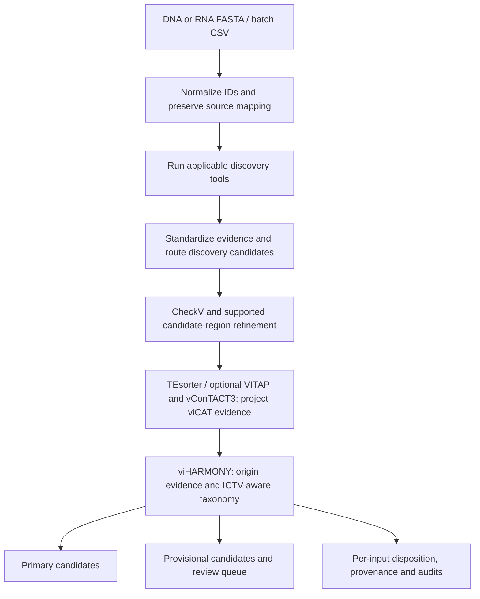

# viSUM

A Nextflow pipeline for viral discovery, candidate-region refinement and standardized evidence-based classification of assembled DNA and RNA sequences.

viSUM combines complementary tools to increase detection of candidate viruses, including understudied and divergent viruses, while integrating their evidence into consistent outputs. It records viral-origin decisions, taxonomic assignments, confidence tiers, conflicting evidence and provenance to support cross-study comparison and reference-database curation.

**Status: research beta in preparation.** DNA and RNA analysis runs and preliminary benchmarks have completed in the development environment. The new preparation-only `--setup` workflow is implemented; full clean-install verification remains pending. This branch is not yet a tagged beta release.

Start with [installation](#prerequisites-and-setup), [single-sample analysis](#start-with-the-default-configuration), [batch analysis](#batch-input), or [preliminary performance](#preliminary-performance).

## What the pipeline does



Discovery admits candidates for evaluation; it does not establish their final identity. viHARMONY integrates support, conflicting evidence, region context and taxonomy. It separates strict from exploratory taxonomy and preserves unresolved/conflicting cases for review. A failed or absent taxonomic assignment is not automatically a nonviral decision.

Confidence tiers summarize evidence support, not calibrated probabilities of correctness. Proviral regions and novel gene-sharing groups are computational candidates for interpretation and follow-up. viSUM is not simply the union of all tool calls.

| Component | DNA | RNA | Role | Enabled by default |
| --- | --- | --- | --- | --- |
| geNomad | Yes | Yes | Discovery evidence | Yes |
| VirSorter2 | Yes | Yes | Discovery evidence | Yes |
| Cenote-Taker3 | Yes | Yes | Discovery and region evidence | Yes |
| DeepMicroClass2 | Yes | No | Sequence-classification evidence | Yes, applicable inputs only |
| GiantHunter | Yes | No | Giant DNA virus discovery | Yes, applicable inputs only |
| Deep6 | No | Yes | Sequence-classification evidence | Yes, applicable inputs only |
| VirBot | No | Yes | RNA virus discovery | Yes, applicable inputs only |
| viCAT | Yes | Yes | Competitive viral/nonviral protein homology and taxonomy | **No** |
| CheckV | Yes | Yes | Post-discovery quality and region evidence | Yes |
| TEsorter | Yes | Yes | Transposable-element interpretation | Yes |
| VITAP | Yes | Yes | Post-discovery taxonomic evidence | **No** |
| vConTACT3 | Yes | Yes | Post-discovery gene-sharing/taxonomic evidence | **No** |

These are workflow routing choices, not a claim that each component has equal biological applicability or sensitivity. Nextflow can display defined processes with `[-]` even when no applicable input is routed to them; that is not evidence that a task ran. Use the trace and task counts to distinguish skipped, cached and executed work.

## Prerequisites and setup

The development runs used Linux and Nextflow 26.04.6. Install a compatible Java runtime and Nextflow following the [official Nextflow instructions](https://www.nextflow.io/), and make Conda and Mamba available on `PATH`: the supplied configuration sets `conda.useMamba = true`. The workflow creates its per-tool environments. Native Windows execution is not validated.

```bash
git clone --branch codex/review-visum-scripts https://github.com/ViDaB-Lab/viSUM.git
cd viSUM

# If nextflow is not on PATH, set this to your actual executable:
export NEXTFLOW_BIN=/absolute/path/to/nextflow

bash ./visum -c visum.config --help
```

The launcher checks `NEXTFLOW_BIN`, then `PATH`, then an executable `../nextflow`. Pass `-c visum.config` explicitly. Do not substitute a CSV/TSV manifest where a single FASTA is required.

This command selects the development branch documented here. Record `git rev-parse HEAD` with your analyses; once a beta tag is published, use that tag for a fixed version.

### Prepare databases separately (optional)

Normal analysis invokes the relevant preparation processes as needed. To prepare enabled tools ahead of analysis, without supplying FASTA files:

```bash
bash ./visum -c visum.config --setup \
  --outdir results/database_setup
```

`--setup` selects tools using the same `--run_<tool> true/false` flags as analysis. It runs global preparations sequentially, without sample normalization, discovery or harmonization. viCAT's sample-specific reference-subset and hit-preparation steps are excluded. Do not supply `--input`, `--prefix`, `--type`, `--prefix_many` or `--indir` with setup.

Defaults prepare neither viCAT nor VITAP nor vConTACT3; enable these explicitly when required. Setup has no DNA/RNA input type, so it prepares both DNA- and RNA-oriented tools when enabled. TEsorter has no standalone preparation process, and setup does not validate every analysis runtime. See [database setup](docs/database-setup.md) for the isolated installation test and remaining validation scope.

### Start with the default configuration

Supply assembled nucleotide sequences; viSUM is not a raw-read assembler.

```bash
bash ./visum -c visum.config -profile local_safe \
  --input /absolute/path/to/contigs.fasta \
  --prefix sample01 --type dna \
  --outdir results/sample01 \
  --max_cpus 8 --max_memory '48 GB'
```

Use `--type rna` for RNA input, including assembled transcripts. Use `-resume` with the same work cache for interrupted runs; retain the cache and Nextflow run metadata. The quickstart runs the configured defaults and **does not reproduce the all-tools benchmark** below.

The Linux launcher caps aggregate CPU scheduling and, where available, CPU affinity. `--max_memory` is a **per-task request ceiling**, not a guarantee that the sum of concurrent tasks fits that amount of RAM. Choose resources for your system; lowering a limit does not make a large database fit in memory. The approximately 400 GB ceiling used on the development server is not a generic minimum requirement.

### Batch input

Create a **comma-separated** file with exactly these columns; FASTA paths below are relative to `--indir`:

```csv
prefix,type,fasta
dna_sample,dna,dna_contigs.fasta
rna_sample,rna,rna_contigs.fasta
```

```bash
bash ./visum -c visum.config -profile local_safe \
  --prefix_many samples.csv --indir /absolute/path/to/inputs \
  --outdir results/batch01 --max_cpus 8 --max_memory '48 GB'
```

Use a unique prefix for each sample and a new output directory for an independent comparison. The current parser does not reject duplicate prefixes; duplicates can cause output collisions.

### Databases and optional components

By default, persistent databases and tool/model bundles are stored under the repository's `databases/` and `tools/`, with Conda environments under `.conda/`. Override the asset roots with `--dbdir` and `--tooldir`; set `conda.cacheDir` separately in a configuration file. Use the same locations for setup and analysis. Automatic downloads require network access and sufficient disk space. Per-tool preparation metadata is published under `<outdir>/database_setup/`.

VirBot is downloaded with its upstream prebuilt reference bundle at a pinned Git revision. Its HMMs, DIAMOND database and reference tables are extracted and validated under `<dbdir>/virbot/VirBot/virbot/data/ref/`; viSUM does not rebuild those references. A complete existing installation can be supplied with `--virbot_dir`.

VITAP and vConTACT3 are enabled with `--run_vitap true` and `--run_vcontact3 true`. Preparation reuses valid local resources without automatically opting into their update workflows. See [VITAP database selection](docs/vitap-database-lifecycle.md) and [general setup](docs/database-setup.md).

viCAT compares predicted ORF loci against viral and class-aware nonviral references, then summarizes competitive locus/cluster evidence. It is optional and requires **both** databases. You can supply completed databases or build them from local source files.

For example, run RNA analysis with completed viCAT databases:

```bash
bash ./visum -c visum.config \
  --input /absolute/path/to/transcripts.fasta --prefix rna_sample --type rna \
  --run_vicat true \
  --vicat_db /absolute/path/to/validated/vicat/database \
  --vicat_nonviral_db /absolute/path/to/nonviral_classaware_v1 \
  --outdir results/rna_sample
```

For source builds, supply the two MetaVR files for the viral side, and classified references or an NCBI manifest/protein/feature-table collection for the nonviral side. See [viCAT database preparation](docs/vicat-database-preparation.md) for exact inputs, recovery behavior and resource requirements. The viral build requests 350 GB RAM by default, exceeding the default 48 GB ceiling; source builds need an explicitly adequate resource configuration. viSUM does not currently host a prebuilt viCAT bundle. Upstream resources retain their own terms.

### Optional RNA homology floor

`--rna_pair_homology_floor true` enables an experimental conservative rule for RNA supported only by the qualified Deep6 + viCAT pair, without strong support. It requires a viral-supported locus with protein length ≥100 aa, bit score ≥100, and query/subject coverage ≥50%. Failing candidates move to provisional output rather than being declared nonviral.

Default is **false**. It has no effect on DNA and is relevant only when Deep6 and viCAT are enabled. The all-tools preliminary results below use **true**. See the [paired ON/OFF analysis](docs/benchmarks/preliminary-2026-09.md#optional-rna-floor-verified-effect) before choosing a setting.

## Reading the outputs

Per-sample outputs are under `<outdir>/<prefix>_results/`. Raw/standardized tool outputs remain in their tool subdirectories; final integration outputs are in `viharmony/`.

| Output suffix | Interpretation |
| --- | --- |
| `.database_candidates.tsv` / `.database_candidates.fasta` | Primary retained candidates; these define the benchmark's viSUM positives |
| `.final.normalized.fasta` / `.final.original_ids.fasta` | Primary sequences with normalized or source-oriented identifiers |
| `.final_metadata.tsv` | Integrated record-level evidence, origin, taxonomy and region information; do not assume every row is a primary retention |
| `.provisional_metadata.tsv` / `.provisional.*.fasta` | Lower-support candidates excluded from primary benchmark counts |
| `.review_queue.tsv` | Decisions/conflicts requiring inspection |
| `.sequence_disposition.tsv` / `.sequence_map.tsv` | Reconcile original inputs, normalized identifiers and derived records |
| `.harmonizer_manifest.json` | Policy settings and output provenance/checksums |

`--harmonizer_audit full` additionally writes compressed row-level audits. Run reports and trace are under `<outdir>/reports/`.

Count original inputs once when comparing detection rates: several region records can derive from one input. `provirus`/`viral_region` annotations are computational candidates, not verified integration events. Provisional/review calls must not be silently counted as high-confidence primary calls. An absence of evidence is not proof of nonviral origin.

## Preliminary performance

Development evidence reviewed 9 September 2026, using archived benchmark runs associated with source snapshot `4f8f377`. The finalized VirSorter2 review-only policy was subsequently checked against saved evidence without changing primary retention. These earlier runs do not validate the new database-setup workflow.

The all-tools configuration enabled viCAT, VITAP and vConTACT3 as well as the default applicable components, with the RNA floor ON. Sensitivity is the fraction of labelled viral inputs retained. Labelled-negative retention is the **label-based false-positive rate (FPR)**: retained negative inputs divided by all negative inputs. Each original input is counted once, even if several regions are extracted.

| Endpoint | viSUM | geNomad |
| --- | --- | --- |
| DNA positive sensitivity | 477/539 (88.50%) | 452/539 (83.86%) |
| RNA positive sensitivity | 788/874 (90.16%) | 646/874 (73.91%) |
| DNA labelled-negative retention, pooled | 101/2,390 (4.23%) | 38/2,390 (1.59%) |
| Plasmid labelled-negative retention | 67/500 (13.40%) | 18/500 (3.60%) |
| Plastid labelled-negative retention | 1/500 (0.20%) | 1/500 (0.20%) |
| Clean-RNA labelled-negative retention | 27/1,600 (1.69%) | 18/1,600 (1.13%) |

On these panels, viSUM detects 25 more DNA-positive inputs and 142 more RNA-positive inputs net than geNomad, while matching its plastid rejection rate. Plasmids account for most viSUM DNA-negative retentions. The plasmid and plastid rows are subsets of the pooled DNA-negative row, not additional inputs.

VirBot is an important RNA comparator: 749/874 positives and 1/1,600 clean negatives. viSUM retains 39 more RNA positives net, with 26 more clean-negative retentions. These comparisons characterize different sensitivity–specificity tradeoffs rather than a universal ranking.

Of viSUM's 101 retained DNA-negative parents, 59 have extracted-region evidence; 23 of those also have a CT3 virion-hallmark annotation in their parent-level summaries. These support follow-up of putative proviral or phage-plasmid candidates, but do not independently resolve their biological identity or verify the retained boundaries. **The reported FPR includes these candidates** so that all tools are compared against the same labels.

Read the [complete comparison of eight discovery methods, negative-evidence audit and subgroup results](docs/benchmarks/preliminary-2026-09.md), including native VirSorter2 calls, and the [finalized adapter-policy replay](docs/benchmarks/virsorter2-hallmark-followup.md). The original review also contains historical development recommendations; the replay documents the resolved VirSorter2 policy.

These are preliminary development benchmarks, not an untouched external validation set. Limitations include shared references/development tuning, transcript/CDS proxy RNA negatives, unresolved biological labels, specialist-tool scope and correlated viral segments. Detection results do not measure taxonomic accuracy, confidence calibration or region-boundary correctness.

## Current limitations and contributing

- The finalized VirSorter2 adapter preserves unscored `lt2gene` hallmark predictions as **review-only evidence**, with no invented score or coordinates. They remain available in standardized/native outputs but supply neither discovery-routing nor primary-retention votes. They cannot corroborate an unlocalized extracted child region or bypass the optional Deep6–viCAT RNA homology floor. See the [implementation/replay follow-up](docs/benchmarks/virsorter2-hallmark-followup.md), which also preserves the rejected promotion-policy experiment.
- Full clean-install verification of the preparation workflow remains pending. Successful analysis runs with existing databases do not test installation from scratch.
- Use unique sample prefixes: automated duplicate-prefix rejection is not implemented.
- A beta tag, release citation, license selection and distribution review remain to be completed. These release-packaging tasks are separate from further biological validation.
- Research use only; not validated for clinical diagnosis or public-health decision making.

Report issues with the viSUM commit/tag, command with private paths redacted, input type, tool/database versions, relevant trace/task logs, expected behavior and observed behavior. Do not upload confidential sequence data or credentials. Small non-sensitive reproducible examples are preferred.

## Citation and licensing

No manuscript citation or release DOI is claimed here. Until a release is finalized, identify the repository and exact commit used. Before a public pre-release, maintainers must select an appropriate license, add author/citation metadata, and verify third-party code/database redistribution terms. The absence of a license is **not** permission to reuse or redistribute; see [GitHub's licensing guidance](https://docs.github.com/en/repositories/managing-your-repositorys-settings-and-features/customizing-your-repository/licensing-a-repository).

When reporting analyses, acknowledge the discovery, refinement and taxonomy tools and reference databases actually enabled—not only viSUM. The [release checklist](docs/benchmarks/preliminary-2026-09.md#required-changes-and-release-gates) distinguishes a citable preliminary software release from manuscript-ready validation.
